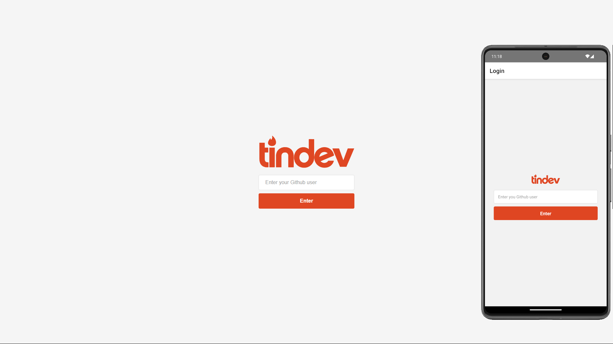

<h1 align="center"> Tindev </h1>

Exclusive and free program, promoted by Rocketseat for teaching Full-Stack technologies.  

  <a href="#-technologies">Technologies</a>&nbsp;&nbsp;&nbsp;|&nbsp;&nbsp;&nbsp;
  <a href="#-project">Project</a>&nbsp;&nbsp;&nbsp;|&nbsp;&nbsp;&nbsp;
  <a href="#memo-license">License</a>

  

 

  
  
  

## 🚀 Technologies

This project was developed with the following technologies:

- HTML and CSS
- JavaScript
- NodeJs
- ReactJs
- React Native
- MongoDB
- Axios
- Github API
- React Navigation
- React Router Dom
- MMKV
- Styled Components
- Git and Github
- Figma

## 💻 Project

Tindev is an application based on Tinder but for Devs. It was created during Rocketseat's Omnistack 8.0 Week classes, being a Full-Stack application, with a NodeJs server, a website with ReactJs and an application with React Native. During the creation of the application I had first contacts with many technologies such as NodeJs, Insomnia and MongoDB among others. During the creation of the application in Rocketseat classes they used AsyncStorage to store data with React Native, however Async Storage was excluded from the React Native community, so I chose to use MMKV and I had to learn some concepts by reading the documentation.
The application has a simple login based on your Github user, it uses GitHub's own API to obtain user data and has like and dislike buttons for each user, if the two users like each other it is triggered a function showing that the two had a match.

## :memo: License

This project is under the MIT license.
